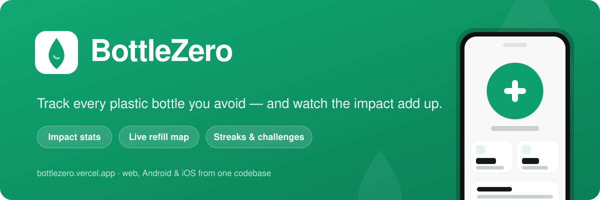

<p align="center">
  
</p>

# BottleZero 💧

<p>
  
  
  
  
  
  
</p>

A Progressive Web App that helps people cut down on single-use plastic bottles — track the bottles you avoid, see your real environmental impact, find places to refill, and turn it into a game with friends.

**Live app:** https://bottlezero.vercel.app
**Built for:** the Congressional App Challenge.

---

## What it does

- **Track** every single-use bottle you avoid, with one tap (and a refill-source picker).
- **See your impact** — plastic, CO₂, and money saved, plus streaks, points, and levels.
- **Find refills** on a live map (real OpenStreetMap fountains + partner spots).
- **Compete** with friends through challenges and leaderboards.
- **Learn** from curated, sourced facts that refresh daily.
- **Dashboard** with charts, trends, and a Python-powered "real-world equivalents" engine.

Works installed (PWA) on phones, tablets, and computers — light/dark themes, offline support, and opt-in daily reminders.

## Tech stack

React + Vite · Tailwind CSS · React Router · Leaflet + OpenStreetMap · Supabase (auth + Postgres) · a Python serverless function on Vercel · PWA. Everything runs on free tiers.

## Run it locally

```bash
npm install
npm run dev      # http://localhost:5173
npm run build    # production build
```

Cloud sync needs Supabase keys. Copy `.env.example` to `.env` and fill in your project's values (the app runs fully without them in device-only mode):

```
VITE_SUPABASE_URL=...
VITE_SUPABASE_ANON_KEY=...
```

## Mobile apps (Android & iOS)

The same React codebase ships as native apps via [Capacitor](https://capacitorjs.com) — there's no separate native code to maintain.

- **Android** — the project lives in `android/`. Build an installable `.apk` with the step-by-step [ANDROID_BUILD.md](ANDROID_BUILD.md).
- **iOS** — add the iOS project on a Mac (`npx cap add ios`) and open it in Xcode.

After changing the app, run `npm run sync` to rebuild the web app and copy it into the native projects. More detail in [NATIVE.md](NATIVE.md).

## More

A full breakdown of the architecture, data model, impact sources, and file structure is in [DETAILS.md](DETAILS.md).
